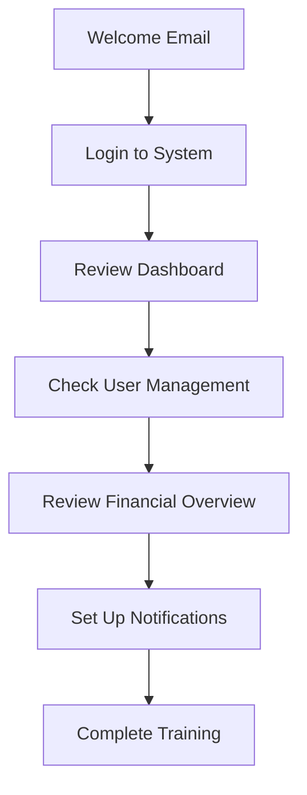
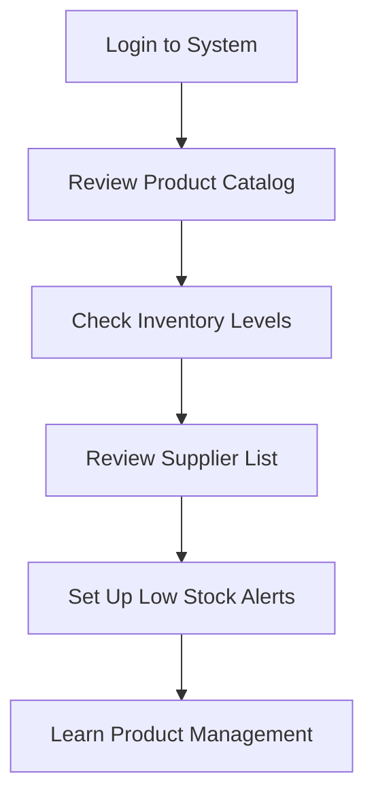
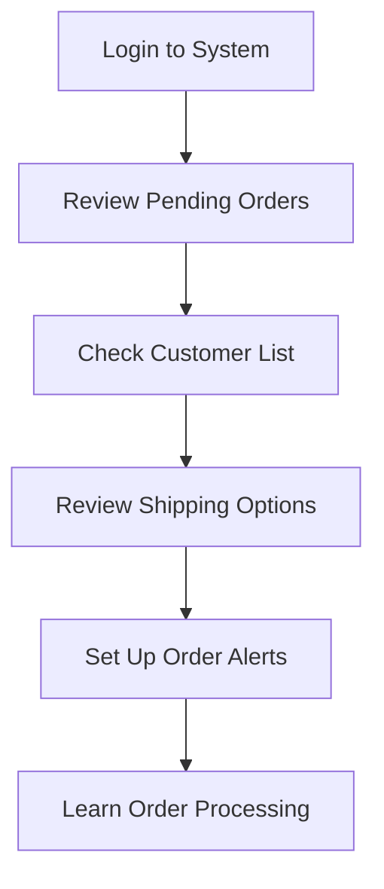
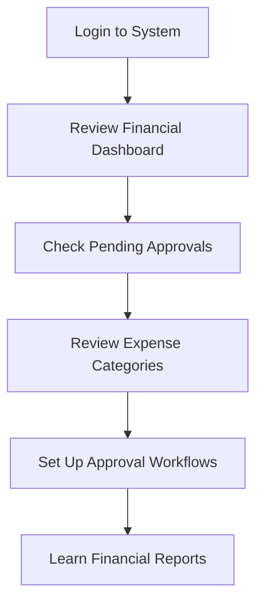
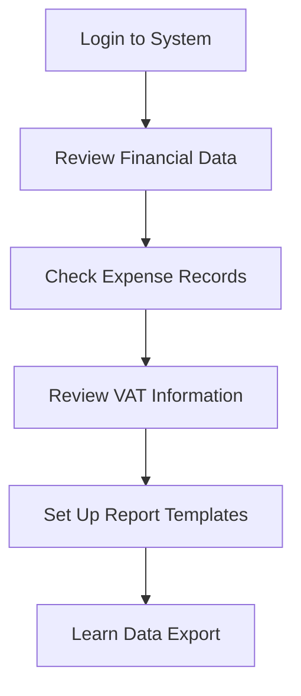
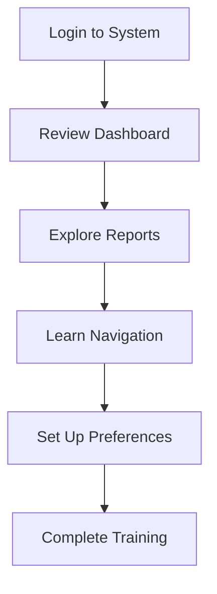

# 🌱 The House Plant Store - Onboarding Guide

Welcome to The House Plant Store! This guide will help you get started based on your role.

## 📋 Quick Start by Role

### 👑 **Super Admin** - Full System Access
- [Complete System Overview](#super-admin-onboarding)
- [User Management](#user-management)
- [Financial Oversight](#financial-oversight)

### 🌿 **Plant Manager** - Product & Inventory Focus
- [Product Management](#plant-manager-onboarding)
- [Inventory Control](#inventory-management)
- [Supplier Relations](#supplier-management)

### 📦 **Order Manager** - Customer & Order Focus
- [Order Processing](#order-manager-onboarding)
- [Customer Service](#customer-service)
- [Shipping Management](#shipping-management)

### 💰 **Financial Manager** - Money & Approval Focus
- [Expense Management](#financial-manager-onboarding)
- [Approval Workflows](#approval-workflows)
- [Financial Reporting](#financial-reporting)

### 📊 **Accountant** - Data & Reports Focus
- [Expense Tracking](#accountant-onboarding)
- [Financial Reports](#financial-reports)
- [VAT Management](#vat-management)

### 👀 **Viewer** - Read-Only Access
- [Dashboard Overview](#viewer-onboarding)
- [Report Access](#report-access)

---

## 👑 Super Admin Onboarding

### Your First Day Checklist



### 🔑 Key Responsibilities
- **User Management**: Create and manage all user accounts
- **System Configuration**: Set up categories, suppliers, shipping rates
- **Financial Oversight**: Monitor all financial activities
- **Security**: Manage permissions and access levels

### 🎯 First Week Goals
1. **Day 1**: Familiarize with dashboard and user interface
2. **Day 2**: Review existing users and permissions
3. **Day 3**: Set up expense categories and suppliers
4. **Day 4**: Configure shipping rates and tax settings
5. **Day 5**: Review financial reports and set up alerts

### 📱 Essential Actions

#### User Management
```
Admin Panel → Users → Create New User
```
- Set appropriate role and permissions
- Send welcome email with login credentials
- Monitor user activity and access

#### System Setup
```
Admin Panel → Categories → Add Category
Admin Panel → Suppliers → Add Supplier
Admin Panel → Shipping → Configure Rates
```

---

## 🌿 Plant Manager Onboarding

### Your First Day Checklist



### 🔑 Key Responsibilities
- **Product Management**: Add, edit, and maintain product catalog
- **Inventory Control**: Monitor stock levels and reorder points
- **Supplier Relations**: Manage supplier information and orders
- **Quality Control**: Ensure product quality and descriptions

### 🎯 First Week Goals
1. **Day 1**: Explore product catalog and inventory
2. **Day 2**: Learn product creation and editing
3. **Day 3**: Set up supplier relationships
4. **Day 4**: Configure inventory alerts
5. **Day 5**: Review and optimize product listings

### 📱 Essential Actions

#### Product Management
```
Admin Panel → Products → Add New Product
```
- Upload high-quality product images
- Write compelling descriptions
- Set accurate pricing and stock levels
- Configure care instructions

#### Inventory Control
```
Admin Panel → Products → View Low Stock
```
- Monitor stock levels daily
- Set up automatic low stock alerts
- Create purchase orders when needed
- Update product availability

#### Supplier Management
```
Admin Panel → Suppliers → Manage Suppliers
```
- Maintain supplier contact information
- Track supplier performance
- Manage purchase orders
- Monitor delivery times

---

## 📦 Order Manager Onboarding

### Your First Day Checklist



### 🔑 Key Responsibilities
- **Order Processing**: Process and fulfill customer orders
- **Customer Service**: Handle customer inquiries and issues
- **Shipping Management**: Coordinate shipping and tracking
- **Returns Management**: Process returns and refunds

### 🎯 First Week Goals
1. **Day 1**: Understand order workflow and statuses
2. **Day 2**: Learn customer service procedures
3. **Day 3**: Master shipping and tracking
4. **Day 4**: Handle returns and refunds
5. **Day 5**: Optimize order processing efficiency

### 📱 Essential Actions

#### Order Processing
```
Admin Panel → Orders → View Pending Orders
```
- Review order details and customer information
- Check inventory availability
- Process payment confirmations
- Update order status

#### Customer Service
```
Admin Panel → Customers → View Customer List
```
- Respond to customer inquiries
- Handle order modifications
- Process refunds and returns
- Maintain customer satisfaction

#### Shipping Management
```
Admin Panel → Orders → Shipping Management
```
- Generate shipping labels
- Track package delivery
- Update customers on shipping status
- Handle shipping issues

---

## 💰 Financial Manager Onboarding

### Your First Day Checklist



### 🔑 Key Responsibilities
- **Expense Approval**: Review and approve expense requests
- **Budget Management**: Monitor and control spending
- **Financial Reporting**: Generate and analyze financial reports
- **VAT Management**: Ensure VAT compliance

### 🎯 First Week Goals
1. **Day 1**: Understand financial dashboard and metrics
2. **Day 2**: Learn expense approval workflow
3. **Day 3**: Review budget and spending limits
4. **Day 4**: Generate financial reports
5. **Day 5**: Set up automated alerts and notifications

### 📱 Essential Actions

#### Expense Approval
```
Admin Panel → Accounting → Pending Approvals
```
- Review expense details and documentation
- Check budget availability
- Approve or reject with comments
- Monitor approval workflow

#### Financial Monitoring
```
Admin Panel → Accounting → Financial Dashboard
```
- Monitor daily revenue and expenses
- Track profit margins and trends
- Review VAT liability
- Set up budget alerts

#### Reporting
```
Admin Panel → Accounting → Reports
```
- Generate monthly financial reports
- Analyze expense trends
- Review VAT returns
- Prepare budget forecasts

---

## 📊 Accountant Onboarding

### Your First Day Checklist



### 🔑 Key Responsibilities
- **Data Entry**: Record and categorize expenses
- **Financial Reports**: Generate accurate financial reports
- **VAT Compliance**: Ensure VAT calculations are correct
- **Audit Support**: Maintain audit trails and documentation

### 🎯 First Week Goals
1. **Day 1**: Understand expense recording system
2. **Day 2**: Learn financial report generation
3. **Day 3**: Master VAT calculations and compliance
4. **Day 4**: Set up automated reporting
5. **Day 5**: Review audit trail and documentation

### 📱 Essential Actions

#### Expense Recording
```
Admin Panel → Accounting → Expenses → Add Expense
```
- Record expense details accurately
- Categorize expenses properly
- Calculate VAT correctly
- Attach supporting documentation

#### Financial Reports
```
Admin Panel → Accounting → Reports → Generate Report
```
- Create monthly financial statements
- Generate expense analysis reports
- Prepare VAT returns
- Export data for external analysis

#### Data Management
```
Admin Panel → Accounting → Export Data
```
- Export financial data for external systems
- Maintain data integrity
- Backup financial records
- Support audit requirements

---

## 👀 Viewer Onboarding

### Your First Day Checklist



### 🔑 Key Responsibilities
- **Data Review**: View and analyze system data
- **Report Access**: Access financial and operational reports
- **Information Gathering**: Collect data for decision making
- **Compliance**: Ensure data access compliance

### 🎯 First Week Goals
1. **Day 1**: Navigate dashboard and reports
2. **Day 2**: Understand data structure and meaning
3. **Day 3**: Learn report generation and export
4. **Day 4**: Set up data access preferences
5. **Day 5**: Complete training and certification

### 📱 Essential Actions

#### Dashboard Access
```
Login → Dashboard → View Overview
```
- Review key metrics and KPIs
- Monitor system performance
- Track important trends
- Access relevant reports

#### Report Generation
```
Admin Panel → Reports → Select Report Type
```
- Generate standard reports
- Customize report parameters
- Export data in various formats
- Schedule automated reports

---

## 🚀 Getting Started - All Roles

### 1. First Login
```
Email: [your-email@thehouseplantstore.co.za]
Password: [temporary-password]
URL: https://admin.thehouseplantstore.co.za
```

### 2. Change Your Password
```
Profile → Settings → Change Password
```

### 3. Complete Your Profile
```
Profile → Edit Profile → Update Information
```

### 4. Set Up Notifications
```
Profile → Notifications → Configure Alerts
```

### 5. Take the Training Module
```
Help → Training → Start Module
```

---

## 📞 Support & Help

### Need Help?
- **Technical Issues**: Contact IT Support
- **Process Questions**: Ask your manager
- **System Training**: Complete online modules
- **Emergency**: Call the support hotline

### Useful Resources
- [System Documentation](link-to-docs)
- [Video Tutorials](link-to-videos)
- [FAQ](link-to-faq)
- [Contact Support](link-to-support)

---

## ✅ Completion Checklist

### Before You're Fully Onboarded:
- [ ] Completed role-specific training
- [ ] Changed default password
- [ ] Set up notifications
- [ ] Reviewed key processes
- [ ] Completed first tasks
- [ ] Met with manager for review

### 30-Day Review:
- [ ] Performance evaluation
- [ ] Additional training needs
- [ ] Process improvements
- [ ] Goal setting for next period

---

*Welcome to The House Plant Store team! 🌱* 